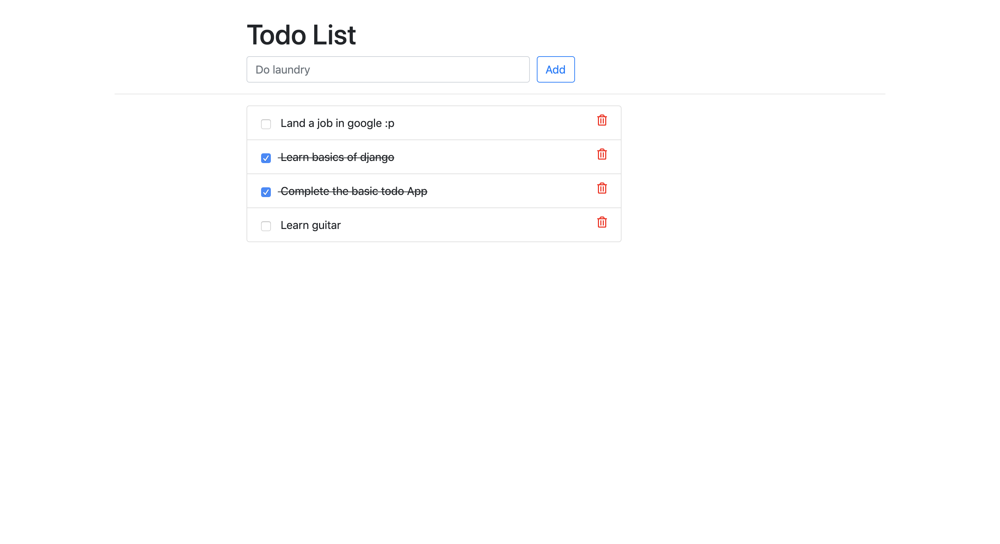

# django-todo
A simple todo app built with django


### Setup
To get this repository, run the following command inside your git enabled terminal
```bash
$ git clone hhttps://github.com/Ryzen-thor/Jenkins-CICD-project.git
```


Cheers and Happy Coding :)
